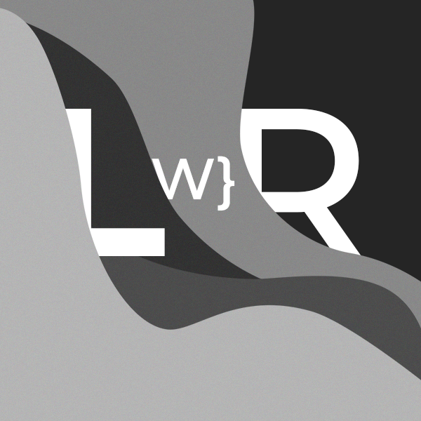

# Learn with Rustam (LWR) - [link](https://learnwithrustam-exp.vercel.app)


Learn with Rustam (LWR) is an innovative online platform offering interactive courses and educational content designed to make learning accessible and engaging for everyone. Whether you're looking to master a new skill or explore a new subject, LWR provides a wide variety of courses across different disciplines, allowing users to learn at their own pace while saving their progress.



## Table of Contents

- [Learn with Rustam (LWR)](#learn-with-rustam-lwr)
  - [Table of Contents](#table-of-contents)
  - [Features](#features)
  - [Installation](#installation)
  - [Usage](#usage)
  - [Folder Structure](#folder-structure)
  - [Contributing](#contributing)
  - [License](#license)
  - [Contact](#contact)

## Features

- **Course Catalog**: Browse and search for courses easily.
- **User Profiles**: Save favorite courses and track progress.
- **Responsive Design**: Accessible on desktops, tablets, and mobile devices.
- **Authentication**: Secure login and registration system using NextAuth.js.
- **Pagination**: Efficient navigation through courses with dynamic pagination.
- **Interactive UI**: Built with React and styled with Tailwind CSS.

## Installation

To get started with the LWR website locally, follow these steps:

1. **Clone the Repository**

   ```bash
   git clone https://github.com/your-username/lwr.git
   cd lwr
   ```
2. **Install Dependencies**

Make sure you have Node.js installed (version >= 14.0.0).

```
npm install
```

3. **Environment Variables**

Create a .env.local file in the root directory and add your environment variables:

```
NEXTAUTH_URL=http://localhost:3000
NEXTAUTH_SECRET=your_secret_key
```

4. **Run the Development Server**

```
npm run dev
```

The application will be available at http://localhost:3000.

## Usage

* Home Page: Browse featured courses and navigate to the course catalog.
* Course Catalog: Search for courses, view details, and save courses to your profile.
* User Profile: View and manage your saved courses.
* Pagination: Use the pagination controls to navigate through courses efficiently.

## Folder Structure

The project structure is organized as follows:

```
learnwithrustam/
├── public/                  # Static assets like images and icons
├── app/
│   ├── about/               # About page for information about LWR
│   ├── course/[id]/         # Dynamic routes for individual course details
│   ├── profile/             # User profile management
│   ├── signin/              # User sign-in and authentication
│   ├── courses/             # List of all available courses
│   └── api/                 # API route handlers for backend logic
│   ├── layout.js            # Main layout component for consistent styling and structure
│   └── page.js              # Default landing page and routing setup
├── components/              # Reusable React components
└── README.md                # Project overview and setup instructions
```

## Contributing

I welcome contributions to Learn with Rustam! Here’s how you can help:

1. **Fork the Repository**: Click the "Fork" button at the top right of this page to create a copy of this repository on your GitHub account.
2. **Clone the Fork**

```
git clone https://github.com/your-username/lwr.git
cd lwr
```

3. **Create a New Branch**

   ```
   git checkout -b feature/your-feature-name
   ```
4. **Make Your Changes** : Implement your changes or new features.
5. **Commit Your Changes**

   ```
   git commit -m "Add your message here"
   ```
6. **Push to Your Fork**

   ```
   git push origin feature/your-feature-name
   ```
7. **Submit a Pull Request**: Go to the original repository on GitHub and create a pull request from your forked repository.

## License

This project is licensed under the MIT License. See the LICENSE file for details.

## Contact

For any inquiries or feedback, please contact us at:

**Email**: karimov.rustam.live@gmail.com
